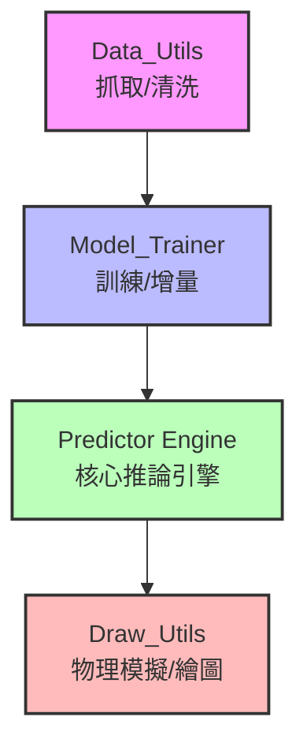

# MLB 擊球分析混合模型 (MLB Hit Predictor Hybrid Model)

結合 **大數據機器學習** 與 **物理模擬** 的混合型擊球分析系統。透過 Statcast 真實數據訓練 XGBoost 模型，預測擊球結果（一壘安打、二壘安打、全壘打、出局）與飛行距離；並利用空氣動力學反推有效阻力係數，繪製 3D 軌跡，實現「資料驅動」與「物理可視化」的整合。

## 專案特色

- **端到端數據處理**：自動抓取 MLB Statcast 數據，清洗並轉換為訓練特徵。
- **雙模型串接架構**：
  - 迴歸模型：預測擊球飛行距離。
  - 分類模型：基於初速、仰角、噴射角及**預測距離**，判斷安打類型。
- **物理混合模擬**：
  - 以空氣阻力公式模擬軌跡。
  - 二元搜尋最佳阻力係數 (Cd)，使落地點與 ML 預測距離一致。
- **可視化儀表板**：3D 球場 + 軌跡繪製 + 完整分析報表。
- **增量訓練支援**：可載入舊模型，僅用新數據微調，適應最新賽季。
- **作弊模式 (Cheat Mode)**：提供 EV 與距離補償增益，用於「如果球打得更強勁會怎樣？」的情境分析。（或是用來自我欺騙（ｘ））

---

## 系統架構


- **Data_Utils.py**：Statcast 數據獲取、清洗、特徵工程。
- **Model_Trainer.py**：全量訓練／增量訓練 XGBoost 雙模型。
- **Predictor_Engine.py**：核心推論引擎（混合 ML + 物理）。
- **Draw_Utils.py**：3D 球場繪製、物理軌跡計算、全壘打判定。
- **Evaluate_Model.py**：載入已訓練模型，輸出分類報告與混淆矩陣。
- **Shell 腳本**：`Get_Data.sh` 簡化數據下載，`Model_Pipeline.sh` 整合訓練流程。

---

## 環境需求

- Python 3.8+
- 建議配備 NVIDIA GPU（用於訓練，推論可只用 CPU）
- 作業系統：Linux / macOS / Windows（WSL 推薦）

### 主要套件

```bash
pip install pandas numpy matplotlib scikit-learn xgboost joblib pybaseball
```
> 注意：`pybaseball` 需要網路連線，第一次執行會快取數據，避免重複下載。

## 快速執行
### 1. 取得數據
執行 `Get_Data.sh` 腳本，可選擇預設日期（2023年3月）或自訂年月。

```bash
./Get_Data.sh
```

手動方式（直接指定年月）：

```bash
python Data_Utils.py --year 2024 --month 6 --dir datasets
```
數據會儲存為 `datasets/ml_data_YYYY-MM-DD_YYYY-MM-DD.csv`。

### 2. 訓練模型
使用 `Model_Pipeline.sh` 整合式選單：

```bash
./Model_Pipeline.sh
```
選項說明：
- 全量重新訓練：指定單一 CSV 檔案訓練新模型。
- 批量合併訓練：自動合併 `datasets` 內所有 2024 年數據進行訓練。
- 增量接續訓練：載入現有模型，用新月份數據微調（保留舊知識）。
- 執行模型評估：顯示分類指標、混淆矩陣、距離預測誤差。
- 使用模型進行預測：進入互動式預測模式。

3. 進行預測
選擇選項 5 後，可進入三種模式：
- 批量 CSV 處理：輸入 CSV 路徑，檔案需包含 `launch_speed`, `launch_angle`, `spray_angle`。
- 即時手動輸入：逐筆輸入初速(mph)、仰角(°)、噴射角(°)。
- 隨機生成測試：自動生成 n 筆隨機數據進行預測。

> 作弊模式：啟動時可加上 `--ev_boost` 與 `--dist_boost` 參數，例如：

```bash
python ML_Physics_Hybrid_Predictor.py --model baseball_dual_model.pkl --ev_boost 1.2 --dist_boost 1.1
```
這會將低於 85 mph 的初速及低於 300 ft 的距離進行補償放大，模擬「最佳狀況」的擊球。

---

## 模組詳細說明
### Data_Utils.py
- `date_check()`：確保月份在 3~11 月，且不超過當前日期。（MLB季賽在 3~11 月間）
- `fetch_and_refine_data()`：呼叫 Statcast API，過濾 `hit_into_play`，計算噴射角 (spray angle)，映射結果標籤 (OUT, SINGLE, DOUBLE, TRIPLE, HR)，儲存 CSV。

### Model_Trainer.py
- 預處理：將 `bb_type` 轉為 one-hot，填補缺失值。
- 特徵定義：
    - 迴歸特徵：`launch_speed`, `launch_angle`, `spray_angle`, `type_*`
    - 分類特徵：上述特徵 + `hit_distance_sc`（串接距離）
- `train_full()`：隨機搜尋最佳超參數，訓練雙模型，儲存為 bundle（含特徵清單、標籤映射、測試集）。
- `train_incremental()`：載入舊模型，以較低學習率接續訓練，避免災難性遺忘。

### Predictor_Engine.py
- `BaseballPredictorEngine` 類別：
    - `run_inference()`：三步驟推論
        1. 用迴歸器預測距離。
        2. 將預測距離加入特徵，用分類器預測結果類別。
        3. `find_fitted_trajectory()`：二分搜尋阻力係數 $C_d$，使物理模擬落地距離 = ML 預測距離。
    - `adaptive_boost()`：作弊模式補償邏輯。
輸出：文字分析報告 + 3D 球場軌跡圖。

### Draw_Utils.py
- `calculate_trajectory()`：4 階 Runge-Kutta 數值積分（含空氣阻力）。
- `draw_field()`：繪製內野鑽石、外野全壘打牆（依角度變動距離）。
- `judge_result()`：根據軌跡與牆高判定是否為全壘打。（目前未使用，舊版留下的函式）

### Evaluate_Model.py
- 載入模型 bundle，對測試集進行串接預測。
- 輸出分類報告、MAE、R2，並繪製混淆矩陣與距離散佈圖。

## 檔案說明

| 檔案 | 功能 |
|------|------|
| `\datasets`| 存放下載後的資料夾 |
| `Data_Utils.py` | 數據下載與前處理 |
| `Draw_Utils.py` | 物理模擬與 3D 繪圖 |
| `Model_Trainer.py` | 模型訓練（全量/增量） |
| `Predictor_Engine.py` | 混合推論引擎 |
| `ML_Physics_Hybrid_Predictor.py` | 使用者互動介面（呼叫引擎） |
| `Evaluate_Model.py` | 模型評估視覺化 |
| `Get_Data.sh` | 數據下載腳本 |
| `Model_Pipeline.sh` | 訓練/評估/預測整合選單 |
| `baseball_dual_model.pkl` | 預訓練模型範例（需自行生成） |

---

## 自訂與擴充

### 新增擊球結果類別
修改 `LABEL_MAP`（位於 Model_Trainer.py 與 Predictor_Engine.py），並調整分類器 `num_class` 參數。

```python
LABEL_MAP = {'OUT': 0, 'SINGLE': 1, 'DOUBLE': 2, 'TRIPLE': 3, 'HR': 4, 'NEW_TYPE': 5}
```

### 調整物理參數
編輯 `Predictor_Engine.py` 中的 `Phsical_Params` 字典，可更改重力、空氣密度、球質量等。
```python=
Phsical_Params = {
    'g': 9.81,        # 重力加速度 (m/s²)
    'rho': 1.225,     # 空氣密度 (kg/m³)
    'area': 0.00421,  # 棒球截面積 (m²)
    'm': 0.145,       # 棒球質量 (kg)
    'dt': 0.01,       # 模擬時間步長 (秒)
    'hit_pos': (0, 0, 1.0)  # 擊球位置 (x, y, z) (m)
}
```

### 調整阻力係數搜尋範圍
在 `find_fitted_trajectory()` 中可修改 `low_cd` 與 `high_cd` 的初始值，或增加迭代次數以提高精確度。

---

## 阻力係數 ($C_d$) 的物理意義
在混合模型中，我們反推的「有效阻力係數」具有以下物理意涵：

| $C_d$ 範圍 | 物理意義|
|------|------|
| < 0.25 | 極佳的 carry，可能帶有強烈後旋 (backspin) 或順風助攻 |
| 0.25 - 0.30 | 一般 MLB 擊球，略帶後旋 |
| 0.30 - 0.35 | 標準物理環境，旋轉效應不明顯 |
| > 0.35 | 阻力較大，可能帶有前旋 (topspin) 或遭遇逆風，球下墜較快 |
> 注意：有效 $C_d$ 是將所有未明確定義的環境因素（旋轉、風向、海拔、濕度等）濃縮成單一係數，用於視覺化擬合，而非真實的物理 $C_d$。

---

## FAQ
### Q: 執行 `statcast()` 時出現連線錯誤？
**A:** MLB 官方 API 有時不穩定，可稍後重試，或檢查網路是否可存取 baseballsavant.mlb.com。也可手動下載 CSV 後放入 datasets 資料夾。

### Q: 增量訓練後模型表現下降？
**A:** 確認新數據特徵分佈與舊數據相似。可降低增量學習率（預設 0.01）或增加 n_estimators。若新數據過少，建議進行全量訓練。

### Q: 物理軌跡落地點與預測距離不符？
**A:** 檢查 `find_fitted_trajectory` 中的單位換算，確保目標距離已轉為公尺。確認二分搜尋收斂條件足夠精確（預設 10 次迭代，可增加至 15-20 次）。

查看是否因 `hit_pos` 的 z 軸高度導致落地點計算誤差。

### Q: 繪圖時出現 `module 'matplotlib' has no attribute 'axis3d'`？
**A:** 確認 `from mpl_toolkits.mplot3d import Axes3D` 已正確導入（Draw_Utils.py 中已包含）。若仍出現問題，可嘗試更新 matplotlib：
```bash
pip install --upgrade matplotlib
```

### Q: 模型評估時出現 `ValueError: could not convert string to float`？
**A:** 這通常是因為分類標籤未正確映射為數值。請檢查測試數據中是否包含 LABEL_MAP 未定義的結果類型（如 `sac_bunt`、`fielders_choice_out `等），並在預處理階段過濾或映射。

### Q: 執行 `./Get_Data.sh` 出現權限錯誤？
**A:** 請賦予腳本執行權限：

```bash
chmod +x Get_Data.sh Model_Pipeline.sh
```

---

## 效能優化建議
### GPU 加速訓練
若您有 NVIDIA GPU，請確保已安裝 CUDA 工具包與支援 GPU 的 XGBoost：

```bash
pip install xgboost-gpu  # 或從源碼編譯以啟用 GPU 支援
```
程式碼中已預設 `device: 'cuda'`，訓練時會自動使用 GPU。

### 記憶體管理
- 處理大量數據時，可在 `train_full()` 中加入取樣機制。
- 使用 `dtype` 優化：讀取 CSV 時指定較小數據類型（如 `float32`）可節省記憶體。

```python
df = pd.read_csv(path, dtype={'launch_speed': 'float32', 'launch_angle': 'float32'})
```
### 批次預測加速
若需大量預測，可修改 `ML_Physics_Hybrid_Predictor.py` 中的 `batch_process_csv()`，使用模型直接預測 `DataFrame`，避免逐列迴圈。

---

## 版本歷史
v1.0.0 (2026-01)
- 支援 Statcast 數據抓取
- 實作雙模型串接架構
- 完成物理軌跡擬合與 3D 可視化

v1.0.1 (2026-01)
- 新增增量訓練功能
- 新增批量訓練功能

v1.0.2 (2026-02-21)
- 初始版本發布
- 修正繪畫功能
- 修正資料讀取功能
- 更新模型訓練流程
- 添加腳本加速使用流程

v1.0.3 (2026-02-22)
- 更新模型結構（回歸模型與分類器分開訓練改為串接）
- 加入作弊模式 (EV Boost / Distance Boost)
- 優化阻力係數搜尋演算法

v1.1.0 (規劃中)
- 支援多球場選擇（使用者可切換球場參數）
- Web 介面版本 (Flask + React) 或其他方式包裝

### 授權條款
本專案僅供學術研究與個人學習使用，嚴禁用於商業賭博或任何違法用途。
- MLB Statcast 數據版權歸 MLB Advanced Media, LP 所有。
- 本專案與 MLB 或任何球隊無關，未經授權不得用於商業營利。
- 使用本專案產生的任何分析結果，使用者需自行承擔法律責任。

---

## 致謝
- pybaseball 團隊提供方便的 Statcast 數據接口
- XGBoost 開發者提供高效能機器學習框架
- MLB 官方 Statcast 團隊提供公開數據

---

## 聯絡方式
如有任何問題或建議，歡迎透過以下方式聯絡：
- 開啟 GitHub Issue
- 寄信至專案維護者：jim930503@gmail.com